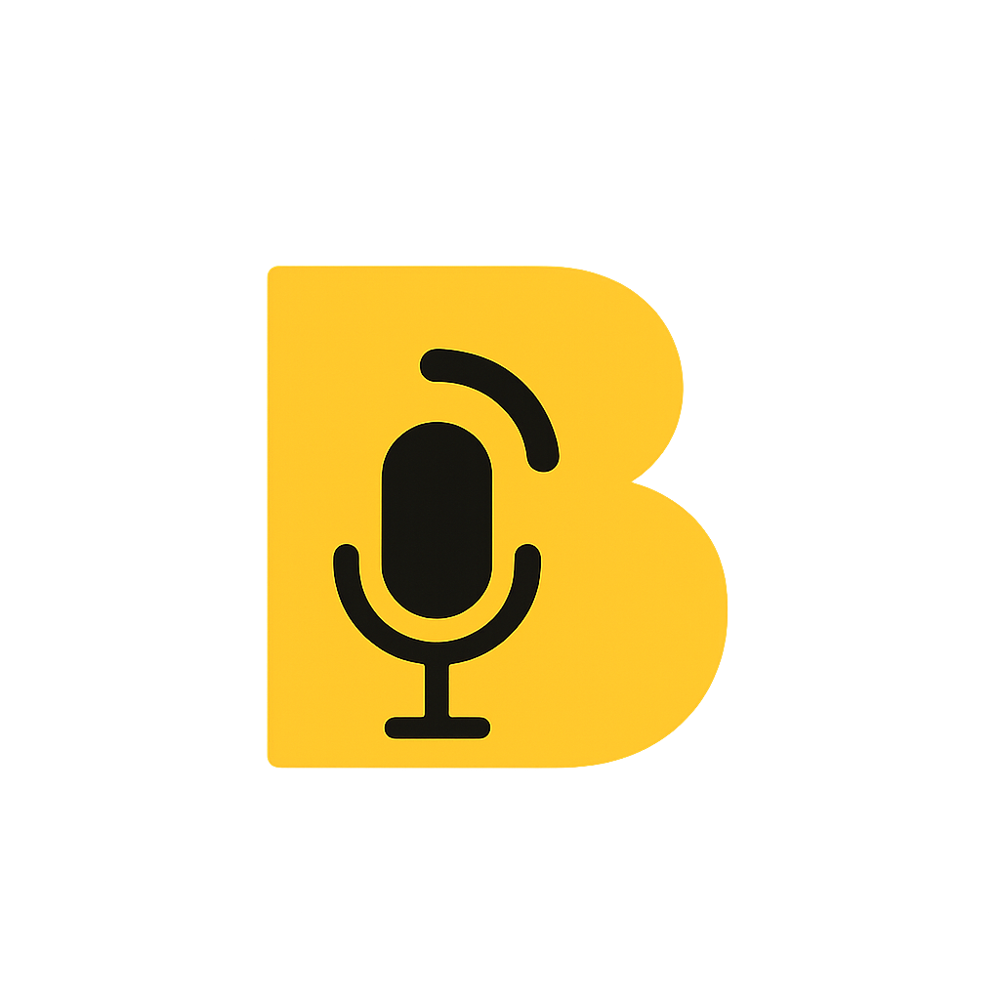

<p align="left">
  
</p>


# Backchannel Orchestra

> **An AI-powered live audience** that reacts in real-time while you practice presentations — cheers, mm-hmms, laughs, or even heckles you!

[](https://murf.ai/falcon)
[](https://deepgram.com/)
[](https://fastapi.tiangolo.com/)

[Watch Demo Video](https://youtu.be/W3jOFd0L278)


**Built using Murf Falcon – the consistently fastest TTS API.**

## Key Features

- **Real-time vocal backchannels** (mm-hmm, wow, go on) in <200ms  
- **Emotional mirroring** – reacts to your sentiment (positive → cheers, nervous → supportive)  
- **Orchestra Mode** – multiple voices respond together like a real crowd  
- **Coach vs Heckler** – switch instantly with voice commands  

## Architecture


**Core Stack**  
Deepgram Nova-2 → FastAPI WebSocket → Logic Engine → Murf Falcon TTS

## Quick Start (30 seconds)

```bash
git clone https://github.com/yourusername/backchannel-orchestra.git
cd backchannel-orchestra
python -m venv venv && venv\Scripts\activate   # or source venv/bin/activate
pip install -r requirements.txt
cp .env.example .env        # add DEEPGRAM_API_KEY + MURF_API_KEY
uvicorn app.main:app --reload
python test_client.py       # start speaking → hear instant reactions!
```

`.env` example:
```
DEEPGRAM_API_KEY=your_deepgram_key
MURF_API_KEY=your_murf_key
MURF_VOICE_ID=en-US-natalie
```

## Voice Commands

| Say this               | Effect                              |
|------------------------|-------------------------------------|
| "Switch to coach"      | Supportive & encouraging            |
| "Switch to heckler"    | Challenging & funny interruptions   |

## Tech Stack

| Layer       | Technology             |
|-------------|------------------------|
| ASR         | Deepgram Nova-2        |
| TTS         | Murf Falcon (multi-voice) |
| Backend     | FastAPI + WebSockets   |
| Sentiment   | TextBlob               |
| Audio I/O   | PyAudio / Web Audio API|

## Team (2 members)

- **Pranav Prashant Shewale** – AI Engineer (ASR/TTS, Logic Engine)  
- **Shourya Agrawal** – Full-Stack Engineer (WebSocket, UI, Streaming)

**Murf Voice Agent Hackathon @ Techfest IIT Bombay**  
`murf-ai` `voice-agent` `tts` `asr` `public-speaking` `fastapi` `deepgram`

**Built with love for the Murf Voice Agent Hackathon**  
Tag: `murf-ai`
